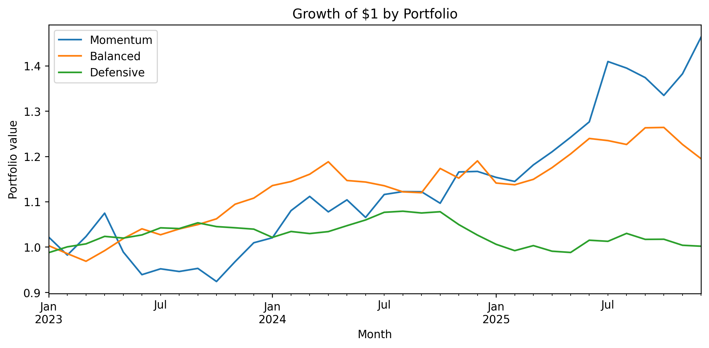
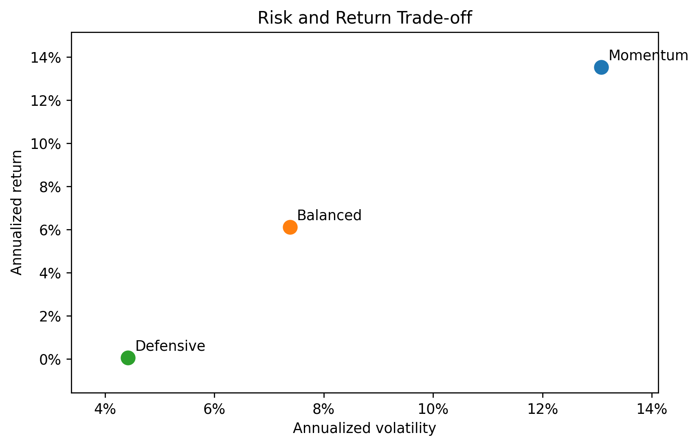
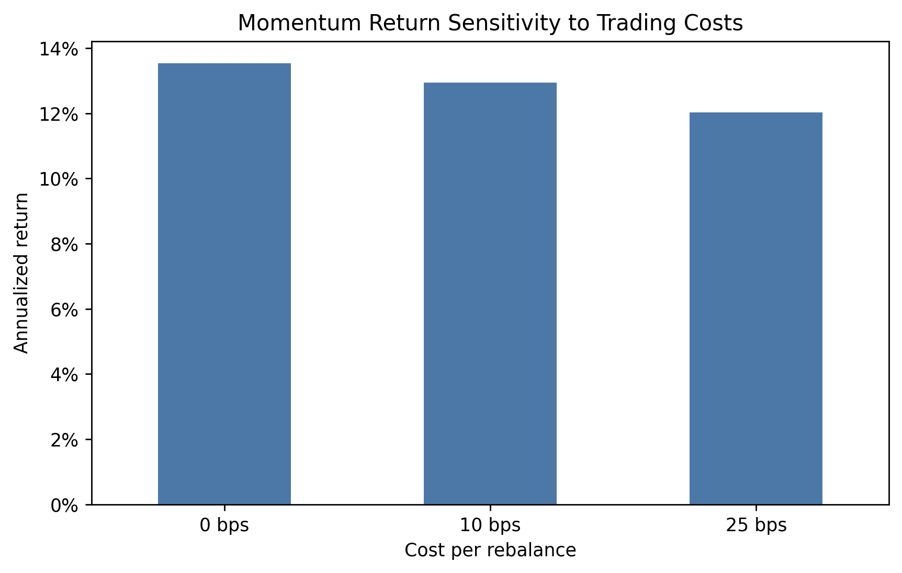

# Portfolio Scenario Report

## Executive Summary

- **Momentum** has the highest simulated annual return.
- **Momentum** has the strongest return per unit of volatility under a zero risk-free rate.
- A 25 bps cost with six annual turns lowers Momentum's annual return from 13.5% to 12.0%.

## Portfolio Growth

The chart shows the path of one dollar. The simulation is short and does not represent a full market cycle.

## Risk and Return

Higher return is not sufficient by itself; the committee should compare it with volatility and drawdown tolerance.

## Sensitivity to Costs

The result declines as the assumed cost rises. The calculation uses constant turnover and does not model taxes or market impact.

## Assumptions and Risks

Returns are synthetic, normally generated, and independent across months. The sample has only 36 observations. Real portfolios can show regime changes, fat tails, correlation shifts, liquidity limits, and larger drawdowns.

## What This Means for You

Use Balanced as the starting comparison and treat Momentum as a higher-risk alternative. Do not approve a portfolio from this sample alone; request longer historical data, drawdown analysis, and cost estimates before a decision.
